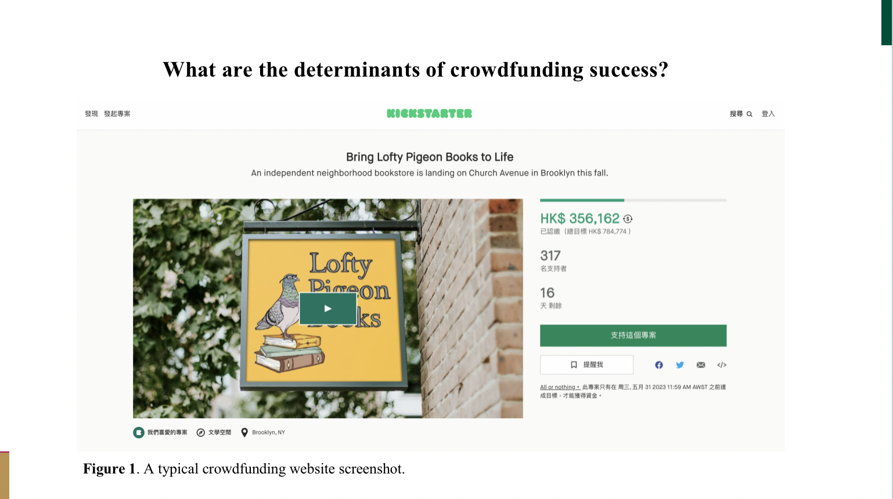

  

It is a indiviual report with six credit score. In this work,I summarize two types of cues that may have an impact on crowdfunding outcomes: explicit cues and implicit cues. Explicit cues emerged as crowdfunding projects started, such as real-time updates of social media comments, support numbers; Implicit cues are set before crowdfunding begins which include various project description in the form of text, image, audio, and video.  

In order to comprehensively measure the predictive effect of different cues on crowdfunding outcomes, I initiated two prediction tasks, respectively. In the first task, I use a logistic regression model to measure the contribution of each feature signal pair. It was found that whether the project included a video, the number of backers, and the number of projects supported were the top three high impact signals. 

In the second task, I used the mainstream deep learning frameworks CNN, RNN, and BERT as language models to compare the prediction performance of text, speech, and video signals under the three models. The results show that the prediction accuracy of text-based signals is generally higher than that of the other two signals, with TextCNN performing best at 76.1% (10.5% improvement over BiRNN and 2.6% improvement over BERT). The experiments for the two tasks were performed on data Kickstarter-3.8 and Kickstarter-1.1, respectively. 

📺 In addition, in order to explore the interaction among different signals, I also designed a multi-modal model, which is detailed in Appendix D.

You can find the final report here:[Crowdfunding Research](../assets/Master_IS6912).
